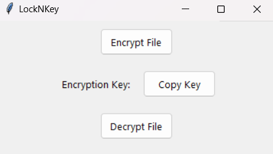
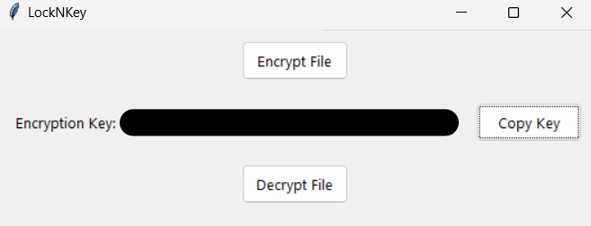
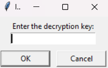

# CSEH 3131516

LockNKey is a straightforward Python application designed to encrypt and decrypt files with ease.

## Installation

To launch LockNKey, you can either :

- run the executable LockNKey.exe in the dist folder

```bash
└── dist
    └── LockNKey.exe
```

OR

- install the necessary dependencies by executing the command below.

```bash
pip install -r requirements.txt
```

```bash
python.exe .\LockNKey.py
```

## Usage (Encryption)

The application looks like this:



- click on "Encrypt file".

- select a file from the file explorer.

- IMPORTANT: remember to click on "Copy key" (it disappears once the application is closed, or after a new encryption).



- 🎊 encryption is complete, the file will replace the previous one. 🎊

## Usage (Decryption)

The application looks like this:


- click on "Decrypt file".

- select the encrypted file from the file explorer.

- paste the key and click "ok"



- 🎊 decryption is complete, you can now read or watch your file securely. 🎊

## Contributer

Côme Bénézet
3131516